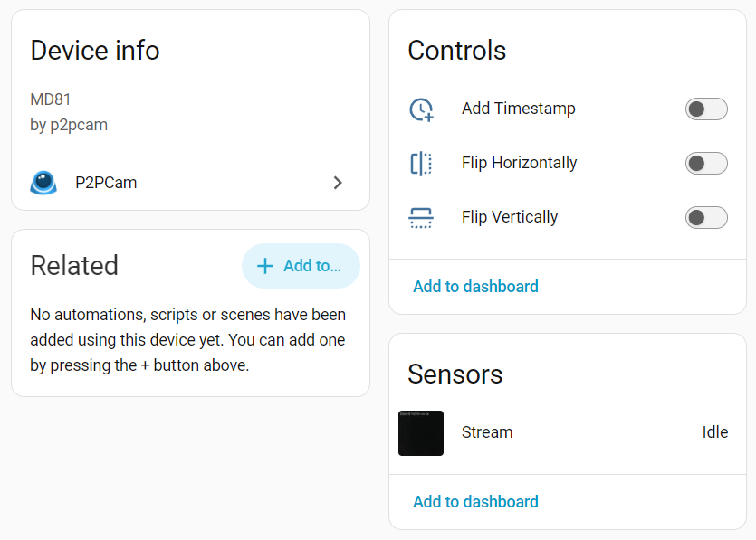
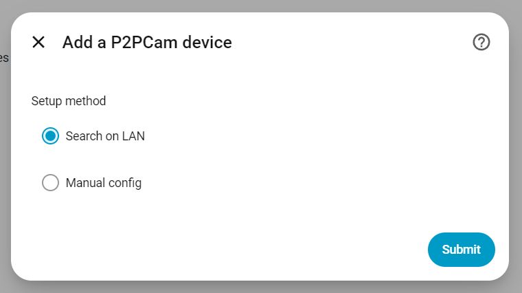
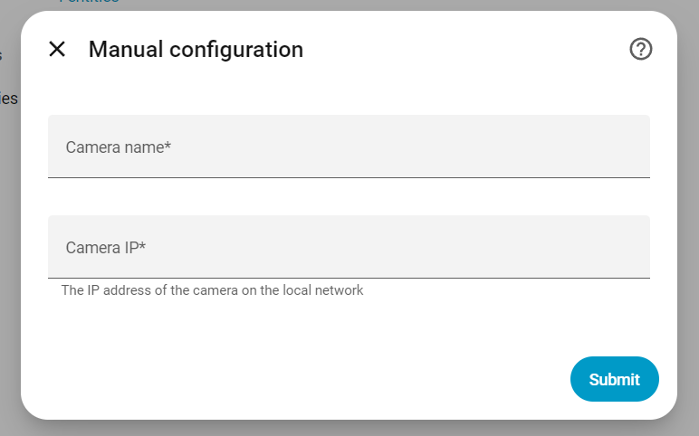

# Home Assistant P2PCam
Home Assistant custom integration to retrieve images from cameras using the p2pCamViewer app.

<p align="center">
  
</p>

First of all, the original connection and retrieval process has been made by [Jheyman](https://github.com/jheyman/) in his [videosurveillance script](https://github.com/jheyman/videosurveillance/).
I rewrote it to run as a class instead of an application and added the Home Assistant code to it.

So I had this [chinese camera](https://usb.brando.com/ontop-p2p-rt8633-hd-high-density-night-vision-wireless-ipcam_p03365c43d15.html) laying around, it had this feature that you could access it from outside your home without the need for port forwarding. However after a couple of years this brand dissappeared and with it their services so I couldn't connect to it outside of my own network using [this app](https://plug-play.en.aptoide.com/app) which made owning this camera quite useless. But I had since gotten into Home Asssistant and got the idea to get it working in there since my instance ran locally so it should be able to access the camera.

This custom integration is based on the [p2pcam module](https://github.com/indykoning/PyPI_p2pcam) which is a python library for connecting to p2pcam cameras.

## Installation

1. Move to your Home Assistant configuration folder

```bash
cd <your-config-dir>
```

2. Create the custom_components folder if it doesn't exist and move to it

```bash
mkdir -p custom_components
cd custom_components
```

3. Clone this repository (make sure git is installed)

```bash
git clone https://github.com/devmlb/home-assistant-p2pcam.git .
``` 

4. Restart Home Assistant.  

5. Go to the Integrations page in Home Assistant, click the `Add Integration` button and search for P2PCam.


> The connection method of these cameras seem quite dodgy so it may take a little while sometimes for the image to be fetched.  
> This will no longer be a problem once a connection has been established and the stream is being received.  
> If you encounter connection errors, try powering off your camera and on again, sometimes it can resolve issues.

## Configuration

You can add your devices in two ways.

### Discovery

The integration will search the LAN for cameras and let you pick one.

<p align="center">
  
</p>

### Manual Configuration

If your camera is not found using discovery, you can add it manually.

<p align="center">
  
</p>

## Disclaimer

I am not an experienced Python or Home Assistant component developer. This is one of my first projects for this, so I would love feedback and [Pull requests](https://github.com/indykoning/home-assistant-p2pcam/pulls) to improve this and maybe even get it into the core.